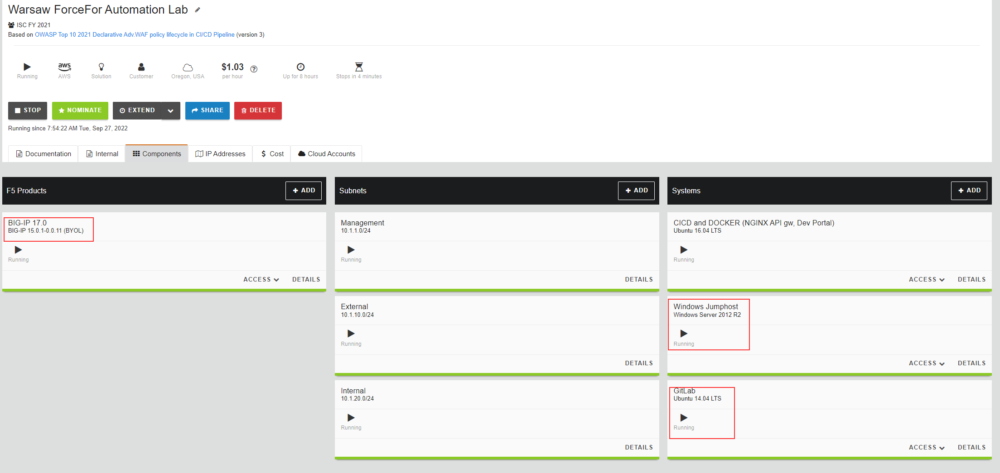

Class 1 - Additional Information on how to use the Lab
=======================================================

The next page (Introduction) will cover the lab environment, access, and lab variables. 

- Windows Jump host - The Windows Jump host has all required tools pre-installed and should be used while you are running through the lab.      
- GitLab - Git repository, to push and run a pipeline of scripts to build a working demo setup on BIG-IP.                                                                                                                                 
- BIG-IP - having LTM and AWF enabled to deliver the application services.

Lab Environment
~~~~~~~~~~~~~~~

The image below represents an overview of the lab environment.
Key elements lab attendees will interact with are as follows:
  
 |intro001|                                                                                   

.. toctree::
   :maxdepth: 3
   :numbered:
   :caption: Labs:
   :glob:
   
   intro*
   exercise*
   close*
