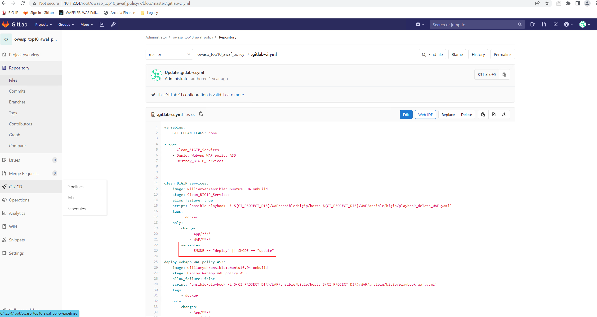
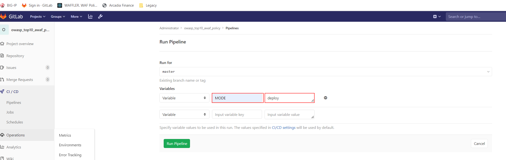
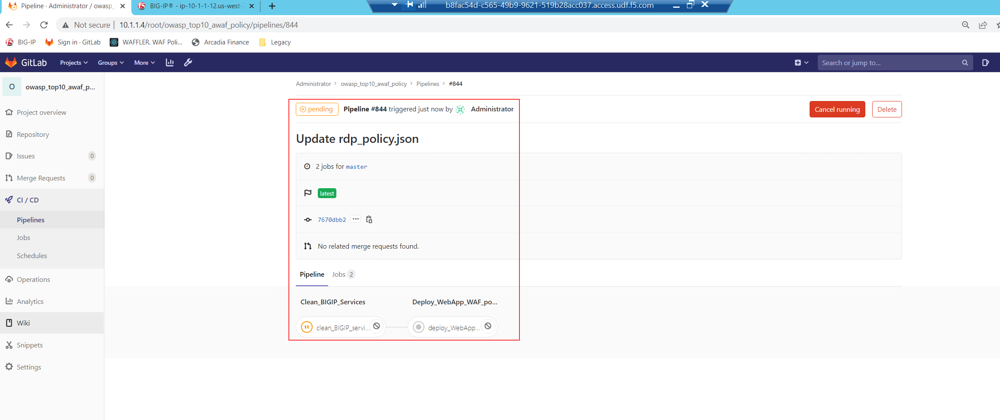

Class 1 - Additional Informations on how to use the Lab
=======================================================

The below should provide a highlevel help to navigate to the lab and the flow.

Task 1: Lab Environment
~~~~~~~~~~~~~~~~~~~~~~~

The image below represents an overview of the lab environment.
Key elements lab attendees will interact with are as follows:

* **Windows Jumphost**      
* **GitLab Instance**                                                                                                                                        
* **BIG-IP running TMOS Version 17.0.**                                                      

 |intro001|                                                                                   

Task 2: Access the Lab Environment - GitLab
~~~~~~~~~~~~~~~~~~~~~~~~~~~~~~~~~~~~~~~~~~~

#. Connect to the **Windows Jumphost** via RDP (Select an appropriate screen resolution for your screen) ensuirng that you login with username/password as **user/user**.
#. Within your **Windows Jumphost** now start the Browser **Chrome**.
#. You will find a Bookmark called **Sign In GitLab**, please click on it.

|intro002| 

Within here you find a Project called "owasp_top10_awaf_policy" - click on it - which contain a single file called ".gitlab-ci.yml" and a folder called "WAF".

The file ".gitlab-ci.yml" containes a GitLab CI configuration. This configuration will trigger the Pipeline operations which are:

* deploy
* update
* destroy
  
|intro003|

The folder called "WAF" contains instructions on how a declarative Security Policy will be pushed to AWAF. The logic on how the files been used:

* *yaml*
* *.as3.json*
* *policy.json*

|intro004| 

You can "deploy" or "delete" a Security Policy on BIG-IP by running a Pipeline inside the CI/CD Menu of GitLab.

|intro005|

The structure is:

* Variable remains Variable - no changes
* "Input variable key" is "Mode"
* "Input variable value" can be set to either "deploy", "update" or "destroy"

Run your first Pipeline by setting the "Input variable key" to "Mode" and the "Input variable value" to "deploy".

|intro006|

You then have the abillity to watch the progress of the deplyoment.

|intro007|

Task 3: Access the Lab Environment - BIG-IP
~~~~~~~~~~~~~~~~~~~~~~~~~~~~~~~~~~~~~~~~~~~

.. |intro002| image:: ./images/gitlab_no1.png
   :width: 800px

.. |intro004| image:: ./images/gitlab_no3.png
   :width: 800px
.. |intro005| image:: ./images/gitlab_no4.png
   :width: 800px

