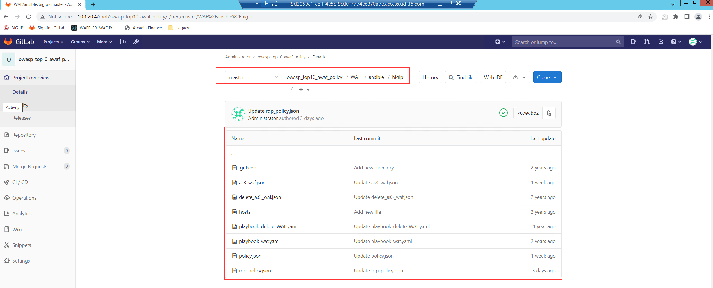

Class1 - Additional Informations on how to use the Lab
######################################################

The below should provide a highlevel help to navigate to the lab and the flow.

**Source Control Management (SCM) - In our Lab we use GitLab**

On your Windows Jumphost there is a Bookmark available on Chrome to access GitLab 

.. image:: ./images/gitlab_no1.png
   :align: center

Within here you find a Project called "owasp_top10_awaf_policy" which contain a single file called ".gitlab-ci.yml" and a folder called "WAF".

The file ".gitlab-ci.yml" containes a GitLab CI configuration. This configuraion will trigger the Pipeline operations which are:

* deploy
* update
* destroy
  
.. image:: ./images/gitlab_no2.png
   :align: center

The folder called "WAF" contains instructions on how a declarative Security Policy will be pushed to AWAF. The logic on how the files been used:

* *yaml*
* *.as3.json*
* *policy.json*

You can run a Pipeline to "deploy" or "delete" a Security Policy on BIG-IP by running a Pipeline inside the CI/CD Menu of GitLab.

.. image:: ./images/gitlab_no4.png
   :align: center

* Variable remains Variable - no changes
* "Input variable key" is "Mode"
* "Input variable value" can be set to either "deploy", "update" or "destroy"
