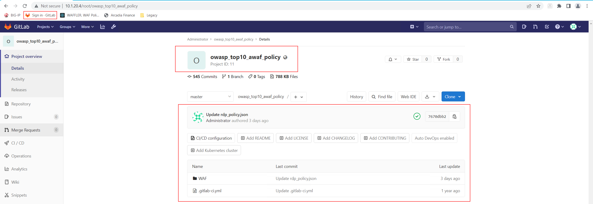
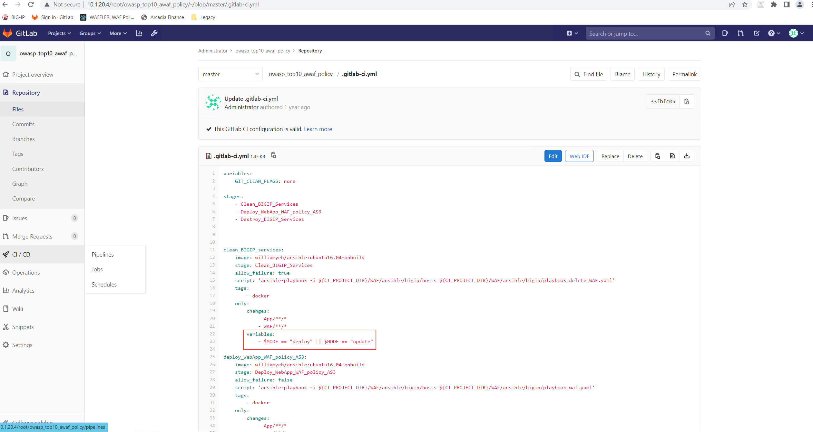
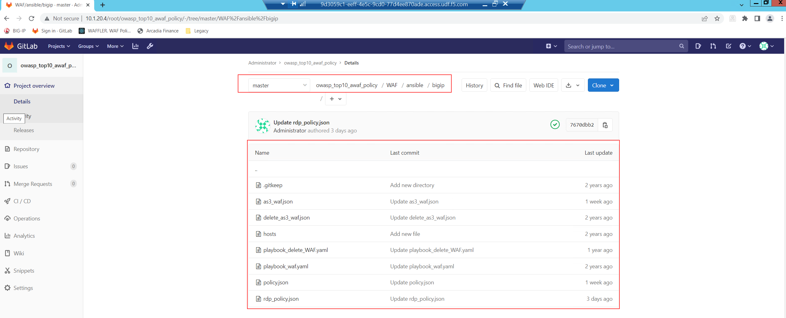
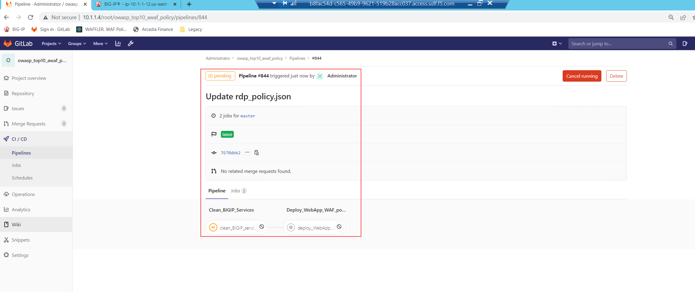

Exercise 1: Access the Lab Environment - GitLab
~~~~~~~~~~~~~~~~~~~~~~~~~~~~~~~~~~~~~~~~~~~~~~~

The main objective of this exercise is to get GitLab hands on experience and deploy your first Rapid Deployment AWAF Security Policy in a declarative way.

#. Connect to the **Windows Jumphost** via RDP (Select an appropriate screen resolution for your screen) ensuring that you login with username/password as **user/user**
#. Within your **Windows Jumphost** now start the Browser **Chrome**
#. You will find a Bookmark called **Sign In GitLab**, please click on it

|intro002| 

Within here you find a Project called "owasp_top10_awaf_policy" - click on it - which contain a single file called ".gitlab-ci.yml" and a folder called "WAF".

The file ".gitlab-ci.yml" contains the GitLab CI configuration. The purpose of this configuration is to trigger different pipeline operations - those are:

* deploy
* update
* destroy
  
|intro003|

The folder called "WAF" contains instructions on how a declarative security policy will be pushed to AWAF. The logic on how the files been used:

* *yaml*
* *.as3.json*
* *policy.json*

|intro004| 

You can "deploy" or "delete" a declarative security policy on BIG-IP by running a pipeline inside the CI/CD Menu of GitLab.

|intro005|

The structure is:

* Variable remains Variable - no changes
* "Input variable key" is set to "Mode"
* "Input variable value" can be set to either "deploy", "update" or "destroy"

#. Run your first Pipeline by setting the "Input variable key" to "Mode" and the "Input variable value" to "deploy".

|intro006|

Within the "Pipelines" menu you have the ability to track the current process of the deployment as well verify whether the pipeline 'passed' or 'failed'.

|intro007|

.. |intro005| image:: ./images/gitlab_no4.png
   :width: 800px
.. |intro006| image:: ./images/gitlab_no5.png
   :width: 800px

