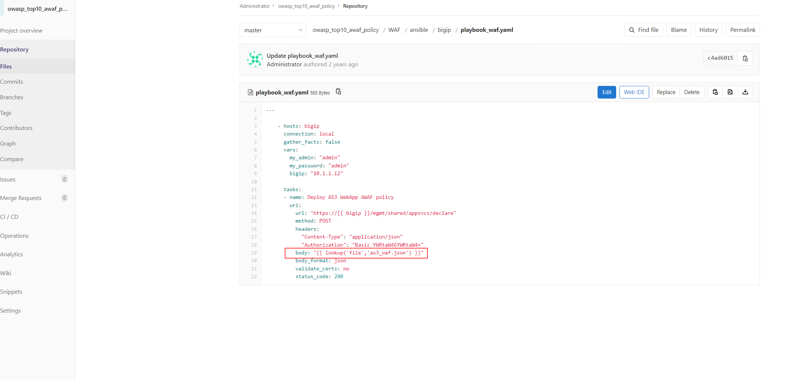

Exercise 2: Access the Lab Environment - BIG-IP
~~~~~~~~~~~~~~~~~~~~~~~~~~~~~~~~~~~~~~~~~~~~~~~

Next is to verify that the security policy has been configured deployed to BIG-IP.

* To do so, open the BIG-IP TMUI by selecting the bookmark on Chrome and login with username/password **admin/admin**
  
* The previous deployed pipeline created a new partition called "Web-Prod". Beside the security policy a Virtual Server, Pool and Node have been deployed inside this new partition
  
* To check the security policy, select the new partition called "Web-Prod" and navigate to Security -> Application Security -> Security Policies -> Policies List
  
* You will see a new security policy named "Arcadia_WAF_policy"

|intro008|

* Within the "General Settings" of the "Policy Configuration" check if the settings align with what has been declared in the Pipeline

|intro009|

.. note:: Within the following you will find an overview on which files will be executed by CI/CD pipeline to apply an AWAF security policy.

* It all starts with running the pipeline by setting the "MODE" variable to "deploy"

|intro006|

This then will trigger two tasks:
   -  TASK [Destroy AS3 WebApp]
   -  TASK [Deploy AS3 WebApp AWAF policy] 

|intro0011| 

If we focus a bit more on the TASK [Deploy AS3 WebApp AWAF policy] you will see, that this task calls a ansible playbook called "playbook_waf.yaml".

|intro0012|

Within GitLab going back to repository -> files -> owasp_top10_awaf_policy -> WAF -> ansible -> bigip you will find the playbook called "playbook_waf.yaml".

|intro0013| 

This ansible playbook called "playbook_waf.yaml" calls a file named "as3_waf.json"

|intro0014| 

Within the "as3_waf.json" file there is AS3 declaration which creates partition, VS, pool and creates AWAF policy on BIG-IP. 
Also, the file calls external source file rdp_policy.json, where actually there is AWAF security policy stored.

|intro0015| 

You will find AWAF policy declaration which will be deployed on BIGIP in rdp_policy.json file.

.. note:: Please delete the current deployment on BIG-IP with help of GitLab. Remember the different Modes available when you issue a Pipeline

|intro005|

* You can verify that the deployment has been deleted proper by either check it within the "run pipeline" in GitLab or whether the partition called "Web-Prod" has been deleted.

|intro007|

|intro010|

|intro0016|

.. |intro005| image:: ./images/gitlab_no4.png
   :width: 800px

.. |intro010| image:: ./images/big-ipno3.png
   :width: 800px

.. |intro006| image:: ./images/gitlab_no5.png
   :width: 800px

.. |intro0016| image:: ./images/pipeline_no6.png
   :width: 800px
