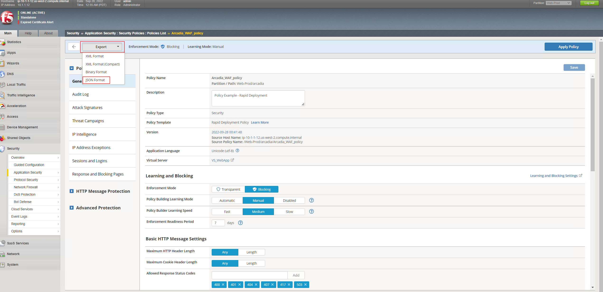
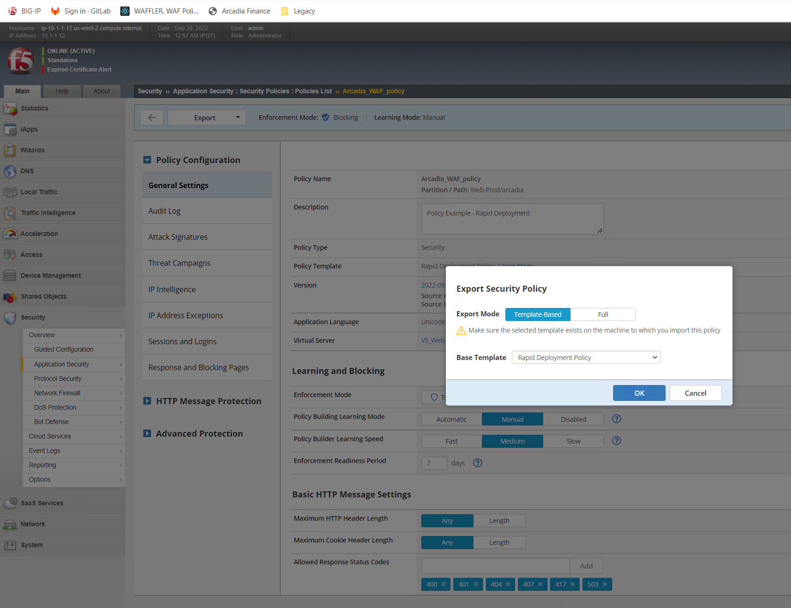
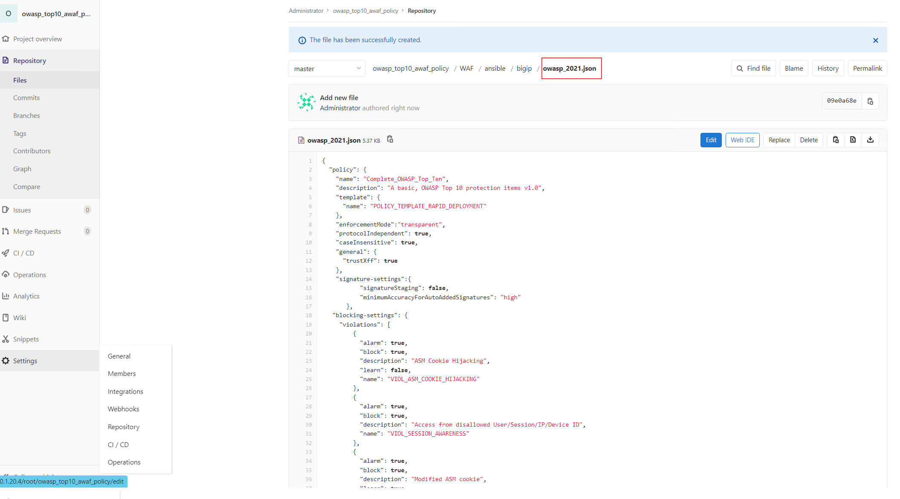
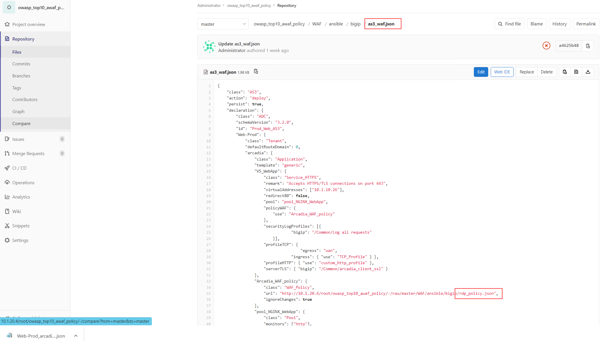

Exercise 3: Deploy a declarative security policy which will be a more [not fully] OWASP Top 10 - 2021 compliant policy
~~~~~~~~~~~~~~~~~~~~~~~~~~~~~~~~~~~~~~~~~~~~~~~~~~~~~~~~~~~~~~~~~~~~~~~~~~~~~~~~~~~~~~~~~~~~~~~~~~~~~~~~~~~~~~~~~~~~~~

At the beginning of the Lab we been talking about three articles to achive a more [not fully] OWASP Top 10 - 2021 combliant policy.

* K45215395: Guide introduction and contents - Secure against the OWASP Top 10 for 2021: https://support.f5.com/csp/article/K45215395

**Community Support on OWASP Top 10 - 2021 inside Dev Central**

* OWASP Top 10 - 2021 Dev Central Article - Part 1: https://community.f5.com/t5/technical-articles/how-to-deploy-a-basic-owasp-top-10-for-2021-compliant/ta-p/295346
* OWASP Top 10 - 2021 Dev Central Article - Part 2: https://community.f5.com/t5/technical-articles/how-to-deploy-a-basic-owasp-top-10-for-2021-compliant/ta-p/295353

The Article "OWASP Top 10 - 2021 Dev Central Article - Part 2" provide some - but not all - examples to achive a OWASP Top 10 - 2021 compliant policy.
It is offering hints rather a full solution.

Within the following Lab we will focus on 3 out of the 10 OWASP Top 10 attack catergories. For those we will provide you the declaration to enahance the security policy.

You will create, modify and understand the concept of a declarative security policy in a way which narrow down to be more [not fully] OWASP Top 10 - 2021 compliant.

**Step 1: Deploy a security policy by running the CICD pipeline. For the purpose of Excercise 4, please use the config named "rdp_policy_non_owasp.json"**

.. note:: On Excercise 2 you learned the structure GitLab and in which order the different instructions been called. Find the name of the AS3 decalaration file and where the policy.json been referenced.
   
As you can see from the below OWASP Compliance Dashboard screenshot in BIG-IP, this policy is far away from being OWASP compliant.

|intro011|

Inside *Exercise 4* you will find three examples to enrich the security policy. These example will change the status of the dashboard for categrories:

-  A1 Broken Access Control
-  A3 Injection
-  A10 Server-Side Request Forgery (SSRF)

As usual, there are multiple ways to achieve a goal:

[1] You can use the BIG-IP UI, to create a security policy, download the policy as JSON and enhance the pipeline on GitLab with the Code changes.

|intro013|

|intro014|

|intro015| 

[2] You can use an external tool called "Policy Supervisor" to create or upload a security policy. Within the tool you got the options to configure different security controls.
FYI: As part of the overall strategy of F5, the tool will allow you to convert a AWAF or NAP security policy into a XC WAAP policy.
Policy Supervisor EA Access:   https://wafwizard.io

|intro016|

[3] Manual enhancement to modify the security policy by using a declarative approach. Those examples are available in Inside *Exercise 4*. 

.. |intro011| image:: ./images/big-ipno4.png
   :width: 800px

.. |intro012| image:: ./images/devcentral_no1.png
   :width: 800px

.. |intro015| image:: ./images/declarative_sec_policy_no1.png
   :width: 800px

.. |intro016| image:: ./images/policy_supervisor_no1.png
   :width: 800px

