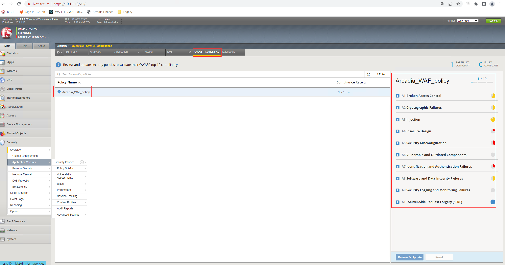
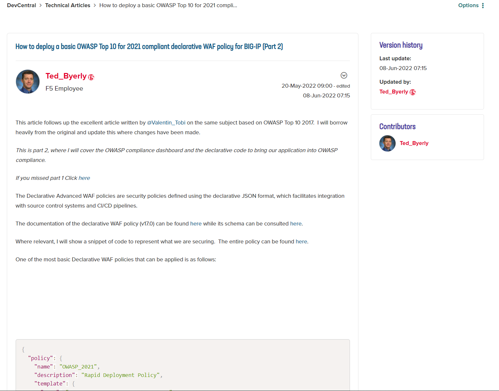
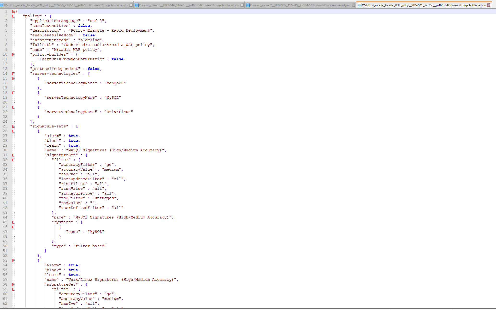
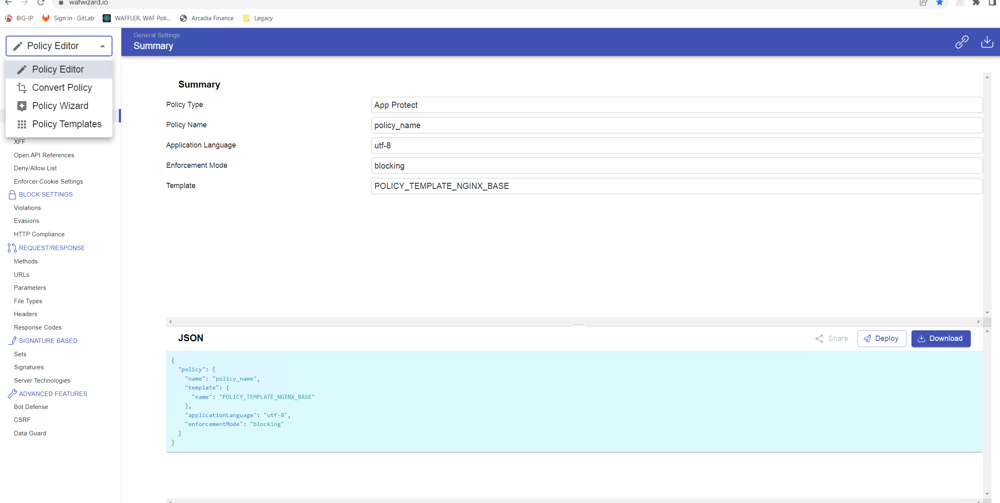

Exercise 3: Deploy a declarative security policy which comply with OWASP Top 10 - 2021
~~~~~~~~~~~~~~~~~~~~~~~~~~~~~~~~~~~~~~~~~~~~~~~~~~~~~~~~~~~~~~~~~~~~~~~~~~~~~~~~~~~~~~~

At the beginning we been talking about two Dev Central Article covering on how to build a security policy which comply with OWASP Top 10 - 2021.

* OWASP Top 10 - 2021 Dev Central Article - Part 1: https://community.f5.com/t5/technical-articles/how-to-deploy-a-basic-owasp-top-10-for-2021-compliant/ta-p/295346
* OWASP Top 10 - 2021 Dev Central Article - Part 2: https://community.f5.com/t5/technical-articles/how-to-deploy-a-basic-owasp-top-10-for-2021-compliant/ta-p/295353

Goal of the exercise now is to create, modify and understand the concept of a declarative security policy in a way which narrow down to be OWASP Top 10 - 2021 compliant.

This article describes an example of a minimal declarative WAF policy that is OWASP Top 10 compliant.
Note that there are policy elements that are customized for the application being protected, in this case a demo application named Arcadia Finance, so they will need to be adapted for each application.

The policy was configured following the pattern described in K45215395: Securing against the OWASP Top 10 for 2021 guide and its conformance with OWASP Top 10 is being verified by
consulting the OWASP Compliance Dashboard bundled with F5's Advanced WAF.

|intro011|

As usual, there are multiple ways to achieve a goal:

[1] You can follow the "OWASP Top 10 - 2021 Dev Central Article - Part 2" which provide a step-by-step explanation.

|intro012|

[2] You can use the BIG-IP UI, to create a security policy, download the policy as JSON and enhance the pipeline on GitLab with the Code changes.

|intro013|

|intro014|

|intro015| 

[3] You can use an external tool called "Policy Supervisor" to create or upload a security policy. Within the tool you got the options to configure different security controls.
     FYI: As part of the overall strategy of F5, the tool will allow you to convert a AWAF or NAP security policy into a XC WAAP policy.
     Policy Supervisor EA Access:   https://wafwizard.io

|intro016|

If you are running out of time, within GitLab we prepared a "owasp_2021" security policy which can be pushed to BIG-IP by changing the AS3 file to point to that specific file.
Please change the URL pointing to the external source of the security policy within "as3_waf.json" from "url" ending: "rdp_policy.json" to url": "owasp_2021.json".

 |intro017|

 |intro018|

.. |intro013| image:: ./images/big-ipno11.png
   :width: 800px

.. |intro014| image:: ./images/big-ipno12.png
   :width: 800px

.. |intro017| image:: ./images/gitlab_no8.png
   :width: 800px

.. |intro018| image:: ./images/gitlab_no9.png
   :width: 800px