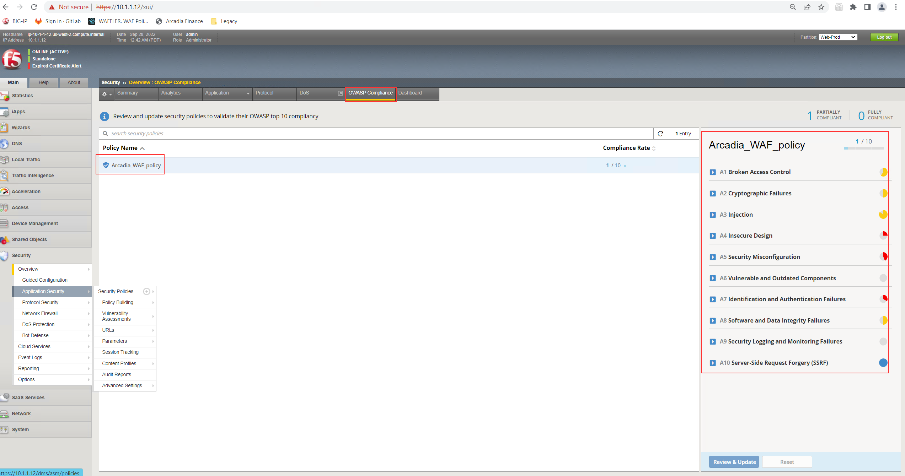
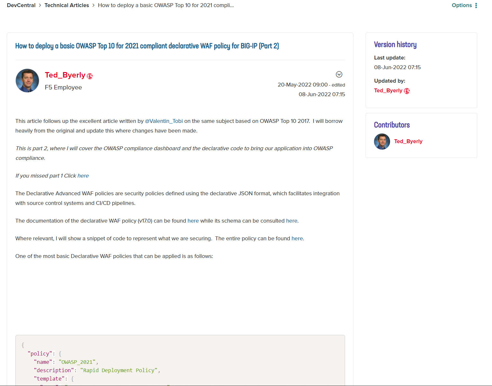
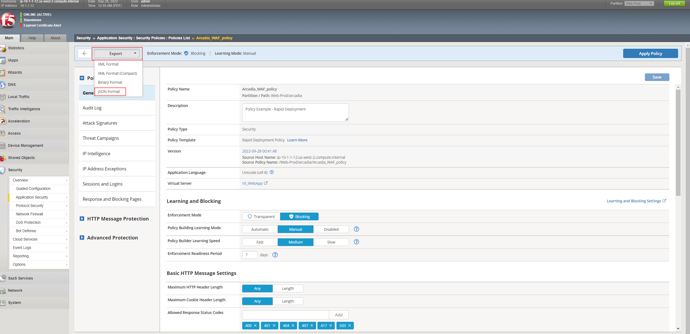
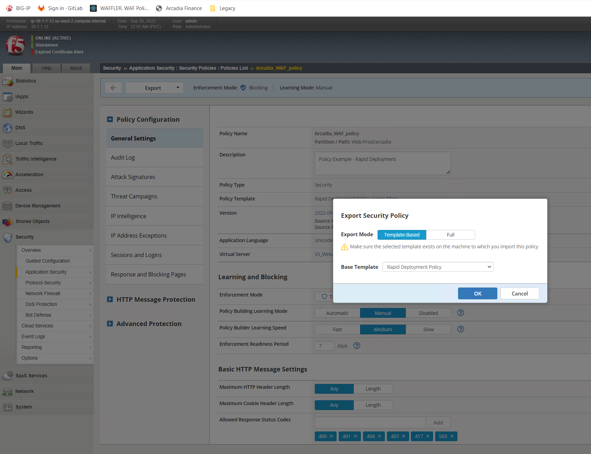
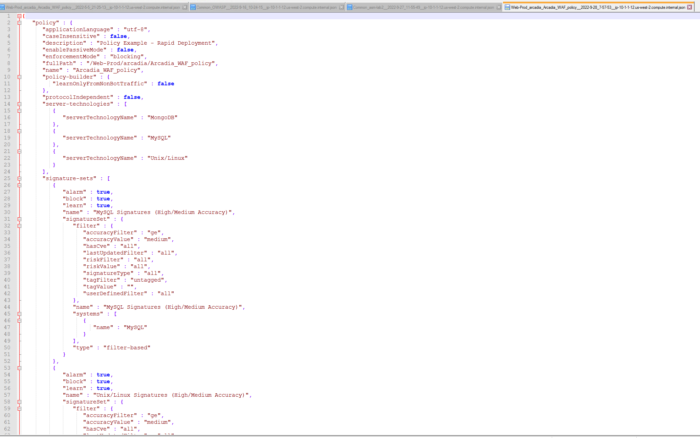
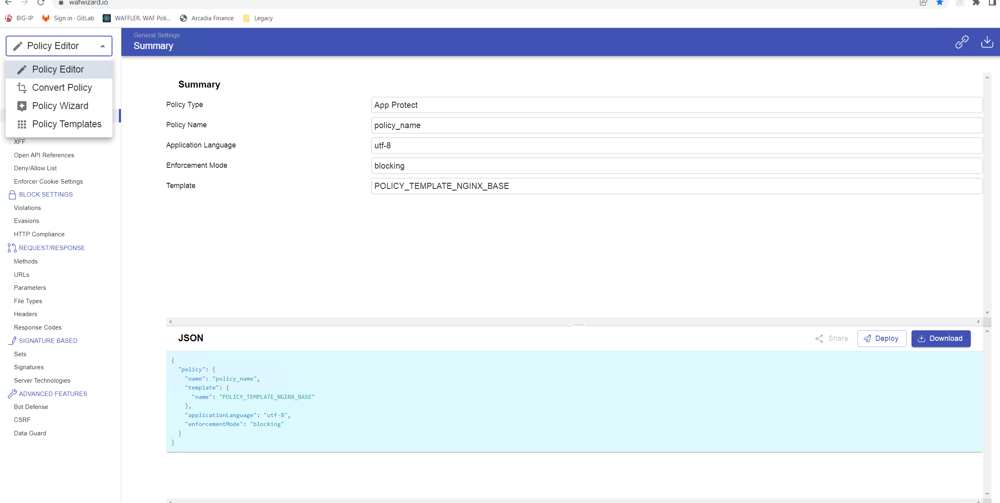
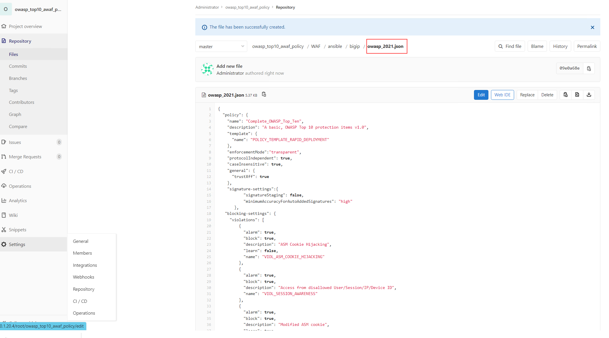
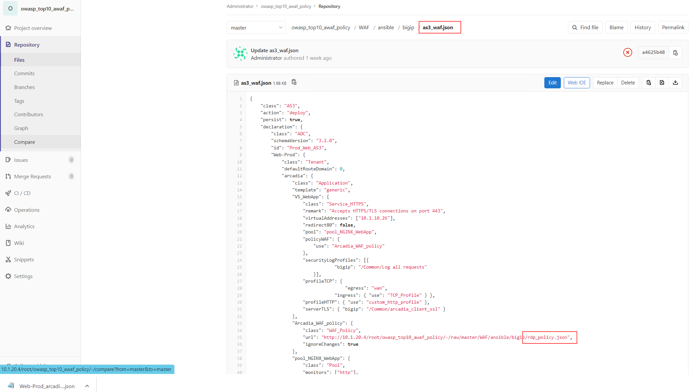

Exercise 4: Manual enhancement to modify the security policy by using a declarative approach
~~~~~~~~~~~~~~~~~~~~~~~~~~~~~~~~~~~~~~~~~~~~~~~~~~~~~~~~~~~~~~~~~~~~~~~~~~~~~~~~~~~~~~~~~~~~~

As mentioned in Excercise 3 in this chapter we will prvide you some hint to achive a more OWASP TOP 10 Compliant Security Policy.

Focus is on:

-  A1 Broken Access Control
-  A3 Injection
-  A7 Identification and Authentication Failures
-  A10 Server-Side Request Forgery (SSRF)

**A1 Broken Access Control**

**A3 Injection**

**A7 Identification and Authentication Failures**

**A10 Server-Side Request Forgery (SSRF)**

At the beginning we been talking about two Dev Central Article covering on how to build a security policy which comply with OWASP Top 10 - 2021.

* OWASP Top 10 - 2021 Dev Central Article - Part 1: https://community.f5.com/t5/technical-articles/how-to-deploy-a-basic-owasp-top-10-for-2021-compliant/ta-p/295346
* OWASP Top 10 - 2021 Dev Central Article - Part 2: https://community.f5.com/t5/technical-articles/how-to-deploy-a-basic-owasp-top-10-for-2021-compliant/ta-p/295353

Goal of the exercise now is to create, modify and understand the concept of a declarative security policy in a way which narrow down to be OWASP Top 10 - 2021 compliant.

The DevCentral article " OWASP Top 10 - 2021 Dev Central Article - Part 2" describes an example of a minimal declarative WAF policy that is OWASP Top 10 compliant.
Note that there are policy elements that are customized for the application being protected, in this case a demo application named Arcadia Finance, so they will need to be adapted for each application.
You achieve the state of being OWASP TOP 10 compliant, without touching BIGIP GUI.

.. note:: Change your policy accordingly the steps in article, use GitLab pipelines and by this make the policy more OWASP 2021 Top10 compliant. 

**First of all deploy a security policy by running the CICD pipeline.**

As you can see from the OWASP Compliance Dashboard screenshot in BIG-IP, this policy is far from being OWASP-compliant, but we will use it as a starting point to build a fully compliant configuration.
With the help of the "OWASP Top 10 - 2021 Dev Central Article - Part 2" t we will go through each vulnerability class and show an example of declarative WAF policy configuration 
that would mitigate that respective vulnerability.

|intro011|

As usual, there are multiple ways to achieve a goal:

[1] You can follow the "OWASP Top 10 - 2021 Dev Central Article - Part 2" which provide a step-by-step explanation.

|intro012|

[2] You can use the BIG-IP UI, to create a security policy, download the policy as JSON and enhance the pipeline on GitLab with the Code changes.

|intro013|

|intro014|

|intro015| 

[3] You can use an external tool called "Policy Supervisor" to create or upload a security policy. Within the tool you got the options to configure different security controls.
     FYI: As part of the overall strategy of F5, the tool will allow you to convert a AWAF or NAP security policy into a XC WAAP policy.
     Policy Supervisor EA Access:   https://wafwizard.io

|intro016|

.. note:: In this lab you will made a few copy and paste operation from DevCentral article to mead your AWAF policy more compliant with OWASP 2021 Top10. You may experience some problems with this copy and paste operations if you will do the on Jumphost only. Therefore, you can open DevCentral article on your local machine and from here copy and paste into Jumphost Gitlab.

.. warning:: If you are running out of time, the DevCentral article " OWASP Top 10 - 2021 Dev Central Article - Part 2" has a hint included to achieve a "OWASP TOP 10 compliant" status.

 |intro017|

 |intro018|

