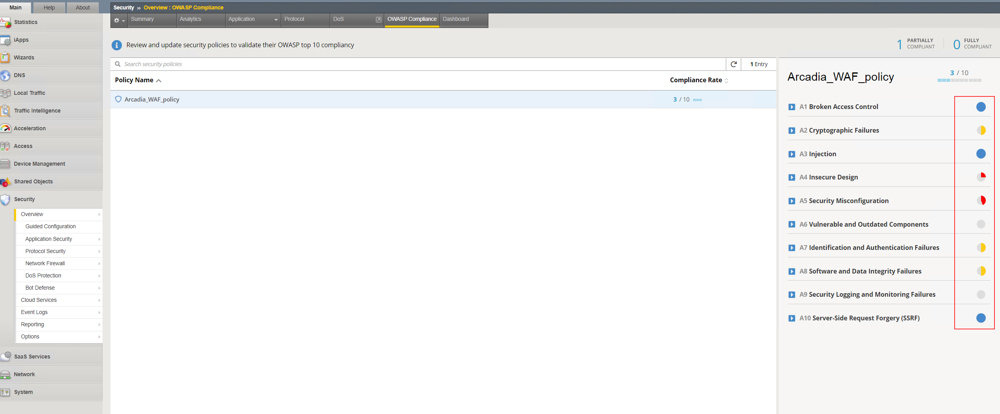

Exercise 4: Manual enhancement to modify the security policy by using a declarative approach
~~~~~~~~~~~~~~~~~~~~~~~~~~~~~~~~~~~~~~~~~~~~~~~~~~~~~~~~~~~~~~~~~~~~~~~~~~~~~~~~~~~~~~~~~~~~~

As mentioned in *Excercise 3* in this chapter we will provide you some hints to achive a more OWASP TOP 10 Compliant Security Policy.
In *Excercise 3* you successfully deployed the non-OWASP Top 10 policy called "rdp_policy_non_owasp.json".

The goal of this exercise is to make the secuirty policy now compliant with:

-  A10 Server-Side Request Forgery (SSRF)
-  A3 Injection
-  A1 Broken Access Control

**A10 Server-Side Request Forgery (SSRF)**

To achive Category A10 compliance, you need to modify some code in "Baseline" section of the "rdp_policy_non_owasp.json" file.

.. code-block:: json
    :caption: Baseline

    "policy": {
        "name": "Complete_OWASP_Top_Ten",
        "description": "A basic, OWASP Top 10 protection items v1.0",
        "template": {
        "name": "POLICY_TEMPLATE_RAPID_DEPLOYMENT"
        },
        "enforcementMode": "transparent",
        "protocolIndependent": true,
        "caseInsensitive": true,
        "general": {
        "trustXff": true
        },
        "signature-settings": {
        "signatureStaging": true,
        "minimumAccuracyForAutoAddedSignatures": "high"
        }
    }

**A3 Injection**

To achive Category A3 compliance, you need to modify some code in "Adjustments" section of the "rdp_policy_non_owasp.json" file.
Specifically in the section "evasions".

.. code-block:: json
    :caption: Adjustments

    "evasions": [
        {
        "description": "Bad unescape",
        "enabled":  false,
        "learn": true
        },
        {
        "description": "Apache whitespace",
        "enabled":  false,
        "learn": true
        },
        {
        "description": "Bare byte decoding",
        "enabled":  false,
        "learn": true
        },
        {
        "description": "IIS Unicode codepoints",
        "enabled":  false,
        "learn": true
        },
        {
        "description": "IIS backslashes",
        "enabled": false,
        "learn": true
        },
        {
        "description": "%u decoding",
        "enabled": false,
        "learn": true
        },
        {
        "description": "Multiple decoding",
        "enabled":  false,
        "learn": true,
        "maxDecodingPasses": 3
        },
        {
        "description": "Directory traversals",
        "enabled": false,
        "learn": true
        }
    ]

**A1 Broken Access Control**

To achive Category A1 compliance, you need to modify some code in "Adjustments" section of the "rdp_policy_non_owasp.json" file.
Specifically in the section "violations".

.. code-block:: json
    :caption: Adjustments

    "violations": [
         {
           "alarm": true,
           "block": true,
           "description": "ASM Cookie Hijacking",
           "learn": false,
           "name": "VIOL_ASM_COOKIE_HIJACKING"
         },
         {
           "alarm": true,
           "block": true,
           "description": "Access from disallowed User/Session/IP/Device ID",
           "name": "VIOL_SESSION_AWARENESS"
         },
         {
           "alarm": true,
           "block": true,
           "description": "Modified ASM cookie",
           "learn": true,
           "name": "VIOL_ASM_COOKIE_MODIFIED"
         },
         {
           "name": "VIOL_LOGIN_URL_BYPASSED",
           "alarm": true,
           "block": false,
           "learn": false
         },
         {
           "alarm": true,
           "block": true,
           "description": "XML data does not comply with format settings",
           "learn": true,
           "name": "VIOL_XML_FORMAT"
         },
         {
           "name": "VIOL_FILETYPE",
           "alarm": true,
           "block": false,
           "learn": true
         },
         {
           "name": "VIOL_URL",
           "alarm": true,
           "block": false,
           "learn": true
         },
         {
           "name": "VIOL_URL_METACHAR",
           "alarm": true,
           "block": false,
           "learn": true
         },
         {
           "name": "VIOL_PARAMETER_VALUE_METACHAR",
           "alarm": true,
           "block": false,
           "learn": true
         },
         {
           "name": "VIOL_PARAMETER_NAME_METACHAR",
           "alarm": true,
           "block": false,
           "learn": true
         }
     ]

When you went trough teh above steps successfully your BIG-IP OWASP Compliance dashboard will look like the following:

|intro020|

In case you are running our of time, please change the pipeline to the json file called "owasp_2021.json".

We hope you learned the logic how declarative schema of AWAF policy is constructed and how to deploy policy changes with CICD GitLab pipelines. 
Now, based on information in Exercises 1-4, you can continue and modify your AWAF policy to be FULLY OWASP complaint!.'

