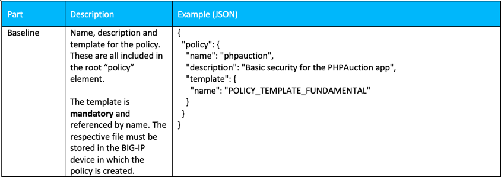
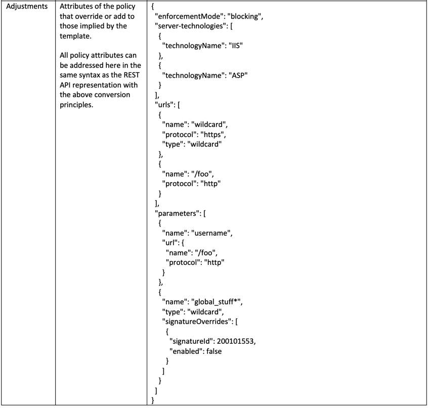
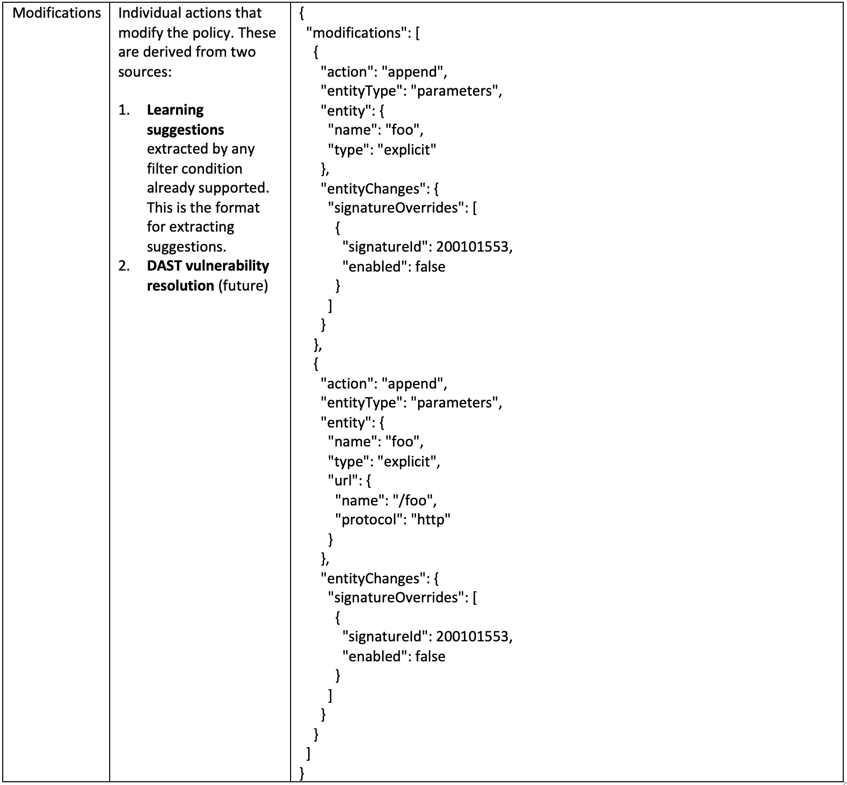

Warsaw, Welcome to the ForceFor Lab Guide
=========================================

.. warning:: Workshop under construction

Welcome to the |classbold| - |year|

|repoinfo|

This Lab will focus on how to integrate F5 AWAF into a CI/CD pipeline. 
The intention of the Lab Guide is to provide helpful content to run trough the Lab on your own pace.
We are not providing a step-by-step exercise, you will find all relevant informations below. 

A high level diagram for "OWASP Top 10 2021 Declarative AWAF policy lifecycle in CI/CD Pipeline" environment can be found below along with the technologies that are being used on this lab.

.. image:: ../sources/images/udf-lab.png
   :align: center

**What's the goal of the Lab?**

By the end of this lab you should be able to:

1. Create an basic Security Policy  

2. Understand how a Security Policy can be automated deployed with the help of GitLab

3. Use GitLab to create and push a Security Policy - which is based on a Rapid Deployment Policy Template

4. Enhance the Security Policy to have a OWASP Top 10 for 2021 compliant declarative WAF policy

In order to successfully complete the lab you should have a basic understanding of some of the DevOps methodologies and tools:

**Source Control Management (SCM)**
(or version control) is the practice of tracking and managing changes to code. Source control management (SCM) systems provide a running history of code development and help to resolve conflicts when merging contributions from multiple sources.

**Infrastructure as Code (IaC)**
is a set of configurations, policies, and profiles considered to be a “deployment artifacts” and can be treated just like code. That means they can be stored and managed in repositories, versioned, and reviewed. They can be pulled, cloned, and committed in the same way a developer pulls, clones, and commits code to and from a repository (like Github).

**Continuos Integration/Continuos Deployment (CI/CD)** 
works by pushing small code chunks to your application’s code base hosted in a Git repository, and, to every push, run a pipeline of scripts to build, test, and validate the code changes before merging them into the main branch.
Continuous Delivery and Deployment consist of a step further CI, deploying your application to production at every push to the default branch of the repository.
These methodologies allow you to catch bugs and errors early in the development cycle, ensuring that all the code deployed to production complies with the code standards you established for your app.

Two main features that make AWAF to DevSecOps integration frictionless
~~~~~~~~~~~~~~~~~~~~~~~~~~~~~~~~~~~~~~~~~~~~~~~~~~~~~~~~~~~~~~~~~~~~~~

* Declarative AWAF policy expressed as a YAML or JSON blob
* Outgoing webhooks for Slack and MS Teams
  
Declarative AWAF policy YAML/JSON file can be used in place of a legacy XML policy (XML policy is still supported) and can be easily applied to an app following the same pipeline of the DevOps toolchain. Policy can be kept in SCM alongside with app source code, and be used by CI server in a traditional DevOps deployment model. Since JSON and YAML are trivially mapped (and JSON can be converted to YAML and vice versa), AWAF supports both file types.
For the purpose of this lab our WAF policy is expressed as a JSON blob.

AWAF policy overview
--------------------

Policy structure
~~~~~~~~~~~~~~~~

AWAF policy consists of 3 parts:

* Baseline policy
* Adjustments
* Modifications

Baseline
^^^^^^^^

**Baseline** policy part defines basic parameters - name, description and a template used for this policy

Adjustments
^^^^^^^^^^^

**Adjustments** part defines overrides and/or additions to the baseline policy. This include any blocking settings overrides, signature settings and outgoing webhooks

Modifications
^^^^^^^^^^^^^

**Modifications** policy part defines individual actions that modify the policy based on AWAF learning or other actions like DAST resolutions

ChatOps
-------

New feature in 15.1 allows AWAF to use outgoing webhooks to send notifications to a Slack or MS Teams channels. This makes a great addition to a commonly-used "ChatOps" method where Devs, DevOps and DevSecOps monitor a particular channel for any notifications raised by SCM, WAF, Ci server etc.
Webhooks are defined explicitly inside the AWAF policy and can be triggered by a number of different events. Notification messages are configurable and may contain various useful information about the event. AS it applies to AWAF, notification message can be sent when the policy has been applied, or a security event has been observed:

**Webhooks are not used in this lab**

**Usefull content**

* Getting Started with Declarative Policies: https://techdocs.f5.com/en-us/bigip-16-1-0/big-ip-declarative-security-policy/declarative-policy-getting-started.html
* Schema of F5 BIG-IP WAF Declarative Policy: https://clouddocs.f5.com/products/waf-declarative-policy/
* OWASP Top 10 - 2021 Dev Central Article - Part 1: https://community.f5.com/t5/technical-articles/how-to-deploy-a-basic-owasp-top-10-for-2021-compliant/ta-p/295346
* OWASP Top 10 - 2021 Dev Central Article - Part 2: https://community.f5.com/t5/technical-articles/how-to-deploy-a-basic-owasp-top-10-for-2021-compliant/ta-p/295353
* Policy Supervisor EA Access:   https://wafwizard.io

To deploy a solution you must be logged into UDF (https://udf.f5.com).

F5ers can access the blueprint directly from UDF without launching a course. 

.. note:: 	If a given topic is not highlighted currently on this page or something is incorrectly documented, please send a Teams Chat to Patrick Zoller.
         	We will do our best to prioritize the development of the content based on demand.

.. toctree::
   :maxdepth: 3
   :caption: Contents:
   :glob: