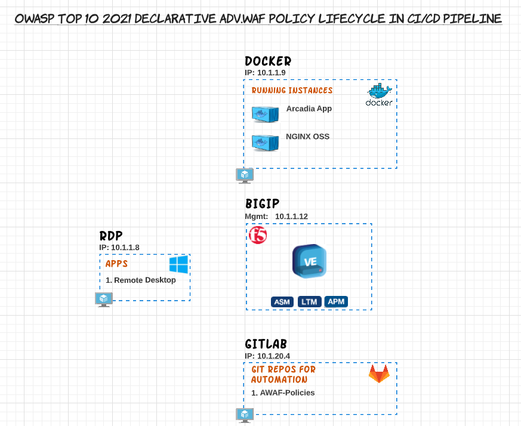

Warsaw, Welcome to the ForceFor Lab Guide
=========================================

Welcome
-------

.. warning:: Workshop under construction

Welcome to the |classbold| - |year|

|repoinfo|

The intention of the Lab Guide is to provide helpful content to run trough the Lab on your own pace.
The Lab Guide is not providing a step-by-step exercise.
You will  find all related informations to work on the lab in the following documentation. 

A high level diagram for "OWASP Top 10 2021 Declarative AWAF policy lifecycle in CI/CD Pipeline" environment can be found below along with the technologies that are being used on this lab.

**What's the goal of the Lab?**

The goal of the Lab is to understand how a deplyoment of an initial Security Policy Deployment can be automated with the help of GitLab.

* In GitLab you start creating a basic policy based on a Rapid Deployment Policy Template with the help of GitLab and push this out to AWAF.
* You then enhance the Security Policy in a way to finally got an OWASP Top 10 for 2021 compliant declarative WAF policy for BIG-IP.

**Usefull content**

* Getting Started with Declarative Policies: https://techdocs.f5.com/en-us/bigip-16-1-0/big-ip-declarative-security-policy/declarative-policy-getting-started.html
* Schema of F5 BIG-IP WAF Declarative Policy: https://clouddocs.f5.com/products/waf-declarative-policy/
* OWASP Top 10 - 2021 Dev Central Article - Part 1: https://community.f5.com/t5/technical-articles/how-to-deploy-a-basic-owasp-top-10-for-2021-compliant/ta-p/295346
* OWASP Top 10 - 2021 Dev Central Article - Part 2: https://community.f5.com/t5/technical-articles/how-to-deploy-a-basic-owasp-top-10-for-2021-compliant/ta-p/295353
* Policy Supervisor EA Access:   https://wafwizard.io

To deploy a solution you must be logged into UDF (https://udf.f5.com).

F5ers can access the blueprint directly from UDF without launching a course. 

.. note:: 	If a given topic is not highlighted currently on this page or something is incorrectly documented, please send a Teams Chat to Patrick Zoller.
         	We will do our best to prioritize the development of the content based on demand.

It covers:

* The 3 main WAAP use cases ``(Class 1)``
  
  * Application exposed on internet and protected by F5XC Global Network (RE only)
  * Application not exposed on internet and only available in a private zone (VPC, VNET, internal VLAN ...) and protected by F5XC Global Network (RE + CE)
  * Application not exposed on internet and protected by F5XS instance in a private zone (CE only)

* How to apply and create a Positive Security policy with F5XC WAAP ``(Class 2)``
* F5XC Shape Bot Protection ``(Class 2)``

* A dedidacted workshop for Modern App Specialists ``(Class 3)``

.. toctree::
   :maxdepth: 3
   :caption: Contents:
   :glob:

   class*/class*
